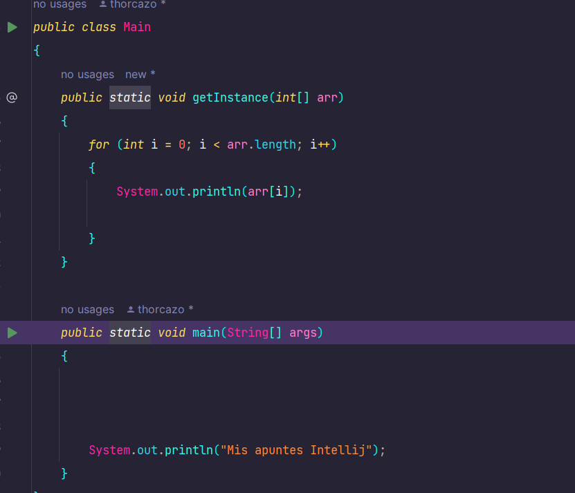

## Trucos Intellij IDEA

5 trucos interesantes sobre intellij IDEA que pueden servir.

### Búsqueda rápida

``CTRL + N``

Con este atajo iremos de forma rápida a una busqueda dentro del editor. 

### Abrir Settings
``ctrl + alt + s``

### Live templates
De forma predeterminada Intellij IDEA tiene templates que pueden ser utiles. 
#### Algunos de ellos:

---
- **main**: crear main
- **fori**: crear 
- **geti**: crea un nuevo metodo
- **itar**: crea un for e itera sobre los elementos de un array
---

### Seccion por contexto

``ctrl + w``

 Puedes seleccionar por contexto en el editor con 'CTRL + W'

### Seleccionar la misma palabra

``ALT + J``

Con este comando y previamente seleccionado el codigo o palabra, cada vez que volvamos a presionar este atajo seleccionará esa misma palabra/codigo. 

